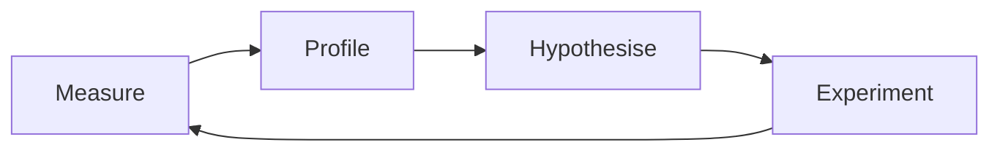

# C# Performance Labs

You know the moment: some perfectly reasonable-looking code is quietly eating a gigabyte of RAM, or takes over 400ms, and you have no idea why yet. C# Performance Lab exists to give you that moment on purpose, somewhere safe: a profiler, a stopwatch, and nobody paging you at 3 a.m.

It's a self-study lab of small, deliberately broken programs. Each one hands you a **symptom**, not a diagnosis ("this export is slow," never "this is doing quadratic string concatenation"), plus a built-in load driver, a pass/fail budget, progressive hints, and a solution write-up for afterwards. You go find the problem yourself with a real profiler, whichever one you've got, fix it, and the harness tells you two things: did you actually make it faster, and did you keep the output correct. No credit for a fast wrong answer.

**New to performance work?** That's exactly who Lab 0 is for. **Already comfortable with .NET internals and just want the exercises?** Also fine: jump straight to Lab 1. Either way, nobody's grading you, and the only deadline is one you set yourself.

## Quickstart

1. Install the [.NET 10 SDK](https://dotnet.microsoft.com/download/dotnet/10.0) (version pinned in [`global.json`](global.json)).
2. Clone the repo and open `PerfLab.slnx` (leave `PerfLab.Solutions.slnx` closed for now, it's the answer key).
3. `dotnet run -c Release --project labs/L00-start-here/exercises/L00-01-activity-feed`, expect `FAIL`.
4. Read the [Lab 0 worked example](docs/worked-example/README.md) to see what a finished attempt looks like, then work the exercise yourself.

Everything below (method, profiler setup, how the harness grades a run) is reference material for once you're in the loop, not required reading before step 3.

## Method



**Measure** first, always: run the exercise and get a real number before you guess. **Profile** to see where that number actually comes from, not where you assume it does. **Hypothesise** one specific, falsifiable cause, in writing, before touching code. **Experiment** by changing exactly one thing. Then you're back at **Measure**: run it again, to see whether the number actually moved and by how much. Loop until it passes.

## Status

Currently built: **85 exercises** across **Labs 0-14** (each lab ends with a final boss fight, except the boss/capstone labs themselves), plus **five Lab 8 exercises** (diagnosing mystery services with the CLI tools only). [ROADMAP.md](ROADMAP.md) has the full map, including what's still only sketched out. Books, articles and docs for every lab are in [docs/READING-LIST.md](docs/READING-LIST.md).

**Start with [Lab 0](docs/worked-example/README.md):** one exercise, already worked (lab log, hints, solution and post-mortem all filled in), so you can see what a finished attempt looks like before you attempt your own.

## Setup
- **.NET 10 SDK** (everything targets `net10.0`; built and verified on .NET 10). The ASP.NET Core labs (9-14) need internet on first build, to pull NuGet packages (EF Core, etc.).
- **A profiler.** Nothing here is tied to one brand: every exercise just needs sampling, tracing, allocation and memory-snapshot views, which most profilers offer in some form. Use whatever you've already got:
  - **JetBrains Rider**, with the dotTrace and dotMemory plugins, what the solution write-ups were measured with, so their terminology comes up most often in the hints.
  - **Visual Studio** (Community edition is enough): Debug → Performance Profiler gives you CPU Usage, .NET Object Allocation and Memory Usage snapshots, covering the same ground.
  - **Standalone dotTrace / dotMemory**, if you'd rather skip the full IDE.
  - **The free CLI tools** (`dotnet-trace`, `dotnet-counters`, `dotnet-gcdump`), cross-platform, no IDE required. Lab 8 is built entirely around them, so you'll get practice either way. [docs/tools](docs/tools/README.md) has a short guide per tool.
  - **PerfView** (Windows) or **`perf`** (Linux), if you want to go closer to the metal.

  **New to the runtime?** [docs/RUNTIME.md](docs/RUNTIME.md) explains tiered JIT, OSR, Dynamic PGO and ReadyToRun, which is why every run is warmed up before it is timed. **New to profiling?** [docs/PROFILING-GUIDE.md](docs/PROFILING-GUIDE.md) opens by explaining what sampling, tracing, timeline, allocations and snapshots each actually *are*, not just when to reach for them, before it maps symptom → mode → tool, whichever tool you land on.
- Open `PerfLab.slnx`. **Leave `PerfLab.Solutions.slnx` closed** until you've passed an exercise: it's the answer key.

### Running an exercise under a profiler, by tool
Whatever you're using, the shape is the same: build **Release**, run with `--profile --seconds 15`, and attach a profiler instead of a debugger. Every exercise and solution project already has two launch profiles in `Properties/launchSettings.json`: **Measure** (no arguments, the default, same as plain `dotnet run`) and **Profile** (`--profile --seconds 15`). The IDE steps below just pick **Profile**.

**A launch profile sets the arguments, not the build configuration.** Launched from an IDE, or with plain `dotnet run`, a project builds **Debug** unless you choose Release yourself, and the harness then prints `!! Debug build detected (JIT optimizer disabled). Numbers are meaningless`. If you see that line, switch to a Release configuration and run again (on the author's machine the same fast solution took 1.1 ms in Debug and 0.7 ms in Release).

- **Rider:** every exercise ships a **Profile** launch profile (from `Properties/launchSettings.json`, program arguments `--profile --seconds 15`): select it in the run-widget dropdown, **switch the solution's build configuration from Debug to Release** (the launch profile can't do this for you), then use the profile action on that configuration (Run menu or the run-widget menu, wording varies by version) and pick a mode. Sampling first, unless a hint tells you otherwise.
- **Visual Studio:** set the exercise as the startup project and pick the **Profile** launch profile in the Debug dropdown (it already carries `--profile --seconds 15`), **switch the solution configuration from Debug to Release** (the launch profile can't do this for you), then Debug → **Performance Profiler** → pick your tools → Start (not F5: that attaches a debugger, which is exactly what you don't want here).
- **CLI tools:** `dotnet run -c Release --project <exercise> -- --profile --seconds 15 &` (or `dotnet run -c Release --project <exercise> --launch-profile Profile &` to use the profile's arguments), grab the pid, then `dotnet-trace collect -p <pid>` or `dotnet-counters monitor -p <pid>`. Full cheat sheet in [docs/PROFILING-GUIDE.md](docs/PROFILING-GUIDE.md).

## How to work an exercise
1. Read the exercise `README.md` (symptom + budgets). If you can resist, don't open `Workload.cs` yet.
2. Run it in **Release**: `dotnet run -c Release --project exercises/<name>` → expect `FAIL`. That's the point.
3. Profile it (see [docs/PROFILING-GUIDE.md](docs/PROFILING-GUIDE.md) for tool options). Use the **Profile** launch profile (or `--profile` on the CLI) so it runs long enough for the profiler to get a real sample.
4. In [LAB-LOG.md](templates/LAB-LOG.md), write **what you saw and your hypothesis** *before* changing code. Yes, really. This is the step everyone wants to skip, and the one that actually builds the intuition.
5. Change **one thing**. Re-run. Repeat until `RESULT: PASS`.
6. Stuck for 15+ minutes? Open one hint from `HINTS.md`. Just one. Then, if you still need it, the next.
7. After passing, read `solutions/<name>/SOLUTION.md`, compare with your fix, then try the "Extra credit" and "Go further" questions.

## The harness
Some of the terms below (gen2, p99, kept-after-GC) won't mean much yet if you're brand new to this. That's fine. Lab 0 and the reading list cover them properly; you'll meet each one for real the first time an exercise actually gates on it. Treat this section as the reference to come back to, not something to memorise up front.
```
dotnet run -c Release --project labs/L01-hot-spots/exercises/L01-01-invoice-export              # warm up, 5 measured runs, PASS/FAIL
dotnet run -c Release --project labs/L01-hot-spots/exercises/L01-01-invoice-export -- --profile # loop ~15s (--seconds N) for profilers
```

- **Exit code:** `0` pass · `1` over budget · `2` wrong result (checksum mismatch: a fast wrong answer doesn't count).
- **Time budgets are scaled to your machine.** They're written in "reference ms": every exercise's budget was
  tuned against the machine this course was built on. Before each measured run, `Lab.MachineFactor()` (in
  [`src/PerfLab.Harness/Lab.cs`](src/PerfLab.Harness/Lab.cs)) runs a fixed, allocation-free CPU loop (40,000,000
  xorshift iterations, `AggressiveOptimization` so tiered JIT doesn't distort it) four times and keeps the
  fastest. That best time, divided by `ReferenceSpinMs` (50 ms, that reference machine's own measured spin
  time), is the machine factor: `factor = bestSpinMs / 50.0`. Every
  `MaxMedianMs`, `MaxP99Ms`, `MaxCpuMs` and `MaxFirstRunMs` budget is multiplied by that factor before comparing; **allocation,
  retained-memory and gen2 budgets are never scaled**, since bytes don't depend on CPU speed the way wall-clock
  time does. Set `PERFLAB_NO_SCALE=1` to force `factor = 1.0` and compare against the raw reference numbers.
  The factor only measures raw CPU throughput, so it under-corrects exercises whose time is dominated by a fixed
  `Task.Delay`/`Thread.Sleep` (most of Lab 9+'s simulated downstream calls): those don't get faster on a
  faster CPU, so a machine that's much quicker than the reference on the spin loop can shrink the budget below
  what the fixed delays alone take, failing a correct solution. If a *solution* fails only on time/p99 while
  everything else passes, suspect this before suspecting the fix.
  Run `-- --calibrate` on any exercise to print this machine's own pinned spin-loop time, if you ever need to
  re-derive `ReferenceSpinMs` for a new reference machine (remember to rescale every exercise's budget by the
  same ratio afterward, not just the constant).
- It warns loudly on Debug builds and when a debugger is attached, both make the timings meaningless, and it'd rather nag you than let you celebrate a fake pass.
- Concurrent GC is off and workstation GC is on (in `Directory.Build.props`) to reduce noise. Later labs flip this on purpose: that's the exercise.
- **Warm-up is time-based** (at least 1 s) so that a correct fix isn't measured while the JIT is still running slow tier-0 code. The **first** warm-up run is timed anyway and printed as `First run: … ms`: if it's far slower than the measured runs, something only goes wrong on a cold start, and warm-up is hiding it.
- Lab 2 exercises can also gate on **gen2 collections per run** (`MaxGen2Collections`), for problems where bytes alone don't tell the whole story.
- Lab 2+ inputs are generated once, on first use, so the harness's warm-up absorbs them and the allocation budget measures only the algorithm.
- Later labs add optional budgets: **kept-after-full-GC** (leaks), **p99 latency** and **CPU time** (concurrency), a **first-run** budget (start-up behaviour), and **named metrics** the workload reports (`sqlCommands`, `connections`, `peakInflight`, …). `--cold` prints every run with no warm-up (Lab 6-07).
- `Workload.Reset()` (where present) clears *test scaffolding* between runs, e.g. a static event hub. It's never part of the fix: if your fix lives in `Reset()`, you've fixed the test, not the code.
